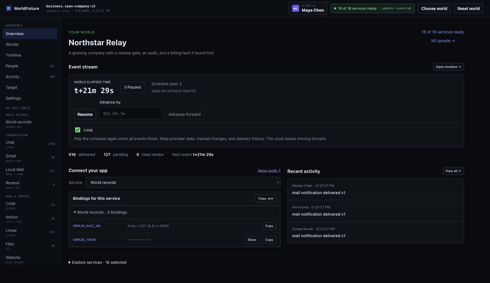
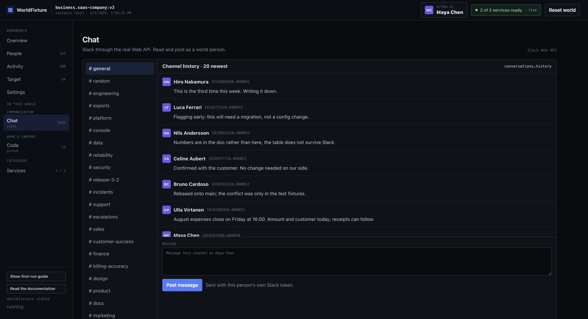

# WorldFixture

[](https://github.com/ben-ic/worldfixture/actions/workflows/ci.yml)
[](LICENSE)
[](#requirements)
[](https://worldfixture.com/docs/)

[Website](https://worldfixture.com/) ·
[Documentation](https://worldfixture.com/docs/) ·
[Quick start](https://worldfixture.com/docs/getting-started/quick-start) ·
[Provider support](https://worldfixture.com/docs/providers/)

WorldFixture runs stateful local provider services for development, demos, and
CI.
Start Slack, GitHub, Google, Notion, Stripe, Local Mail, S3, and more with one
shared synthetic dataset. Connect your app through local APIs and protocols,
inspect live state in the Workbench, and reset it. No production accounts or
credentials are required.

For example, DropLive uses WorldFixture for product demos.

```sh
npx worldfixture up
```

List the available world artifacts and select one by its manifest identity:

```sh
npx worldfixture worlds
npx worldfixture up consumer.retail-brand:v1
```

An explicit world takes precedence over the project's `world` setting. Without
either, `up` selects `business.saas-company:v3`. See [How worlds work](https://worldfixture.com/docs/guides/worlds)
for artifact paths, project settings, and date handling.

Use **Choose world** in the Workbench or `npx worldfixture switch <world>` to
change a running world. A switch restores provider state and changes credentials.
Application database data remains. Confirm the new application connection before
you start its timeline. See [Switch a running world](https://worldfixture.com/docs/guides/worlds#switch-a-running-world)
and [Timeline controls](https://worldfixture.com/docs/guides/timeline).

All people, organizations, domains, messages, and financial records are
synthetic. WorldFixture is pre-release software. It implements selected
provider operations and does not claim full provider parity.

## Requirements

- Docker
- Node.js 22 or later
- An `arm64` or `amd64` computer

## First run

Run all WorldFixture commands from the same project directory. Start only Slack
for the shortest first run:

```sh
npx worldfixture up --only slack
```

The command prints progress, the Workbench URL, and the local Slack API
endpoint. It uses free host ports, so do not assume port numbers. In a second
terminal, open the Workbench:

```sh
npx worldfixture open
```

Get the API endpoint and local credentials for your application:

```sh
npx worldfixture env --json
```

You now have a local Slack API and a Workbench that uses the same state.

Read the [five-minute quick start](https://worldfixture.com/docs/getting-started/quick-start) for the
complete path. If a start fails, run `npx worldfixture doctor`.

Read the [documentation website](https://worldfixture.com/docs/), or run it locally:

```sh
npm --prefix docs ci
npm run docs:dev
```

The website includes local search, navigation, provider support tables, SDK
examples, Workbench guidance, reset rules, HTTP targets, troubleshooting, and
contributor documentation.

## See the Workbench

**Overview** shows the current world, service readiness, and application
connection values. Credentials are hidden.

[](docs/public/workbench/overview.png)

**Chat** shows Slack channels and message history. Select a world person to
read and post through the same provider API that your application uses.

[](docs/public/workbench/chat.png)

These screenshots show `business.saas-company:v3` with Slack and GitHub
selected. Your services, counts, and ports can differ. Select an image to open
it at full size. See the [Workbench guide](https://worldfixture.com/docs/guides/workbench)
for more screenshots and instructions.

## Connect an application

Use the values from the current run:

```sh
npx worldfixture env
npx worldfixture run -- npm run dev
```

For an application connector:

```sh
APP_URL=http://localhost:3000 # Replace this with the URL your app prints.
npx worldfixture connector prompt "$APP_URL"
npx worldfixture connector check "$APP_URL"
npx worldfixture connector plan "$APP_URL" --scale smoke
npx worldfixture connector seed "$APP_URL" --scale smoke
```

See [Connect an application](https://worldfixture.com/docs/getting-started/connect-an-app),
[Bindings](https://worldfixture.com/docs/guides/bindings), and the
[connector overview](https://worldfixture.com/docs/connectors/overview).

## Provider support

The [provider support index](https://worldfixture.com/docs/providers/) states which endpoints,
writes, SDK versions, Workbench views, events, and limitations have evidence.
It uses these labels:

- Supported and contract-tested
- Supported but partial
- Workbench-only
- Not supported
- Not verified against the production provider

## Build from this checkout

```sh
npm run build:worlds
npm run build:workbench
docker buildx build --load -t worldfixture:local .
node runtime/bin/worldfixture.mjs up --image worldfixture:local
```

Create and build a world:

```sh
npx worldfixture new ./my-world
npx worldfixture validate ./my-world
npx worldfixture build ./my-world
npx worldfixture up ./dist/demo.minimal.v1
```

The copy keeps the starter world's id and version until you change them in
`world.json`, which is why `build` writes `dist/demo.minimal.v1` rather than a
path named after the directory.

See [How worlds work](https://worldfixture.com/docs/guides/worlds) and
[How WorldFixture fits your development loop](https://worldfixture.com/docs/architecture).

## Development

Run the documented checks from the repository root:

```sh
python3 -m pip install .
PYTHONPATH=compiler python3 -m unittest discover -s tests -t .
npm run docs:check
npm run docs:diagrams:check
npm run docs:build
npm --prefix runtime/workbench-ui ci
npm --prefix runtime/workbench-ui run build
npm --prefix emulators/emulate ci
node scripts/prepare-service-images.mjs
(cd runtime && node --test)
(cd emulators/emulate && node --test)
node --test emulators/http-targets/test/feed-clock.test.mjs
node emulators/http-targets/test/protocol-test.mjs
```

The Python command tests the compiler, schemas, and world parity. `build` is the
CLI command that runs the compiler.

Run the supplemental Gmail arrival and Linear identity check against a built
product image. Use a new report directory for each run:

```sh
node tests/image/coupling-arrival-test.mjs --image worldfixture:local --report .worldfixture/coupling/arrival-check
```

This test copies the v2 source and adds two Gmail arrivals for nonprimary
recipients, custom labels, and two Linear tasks with the same title and distinct
IDs. It checks normal scheduled delivery and reset through public APIs, reads
every declared mailbox with that person's credentials, and verifies that shipped
source bytes remain unchanged. The report includes the copied source and its
artifact digest. Shipped SMTP arrivals keep their original transport.

The next two are prerequisites of the **runtime** suite, not only the emulator
one, and both are no-ops once they have run. `emulate` starts as a child process
that imports `@emulators/core` on its first line, so without its dependencies it
exits immediately and 22 runtime tests fail on a readiness check that reports
only `fetch failed`. `prepare-service-images.mjs` builds or pulls the service
images the manifests name; without it the supervisor builds a missing image
inside a test's own readiness budget, which is not long enough to build Cyrus
from a Debian base.

See [CONTRIBUTING.md](CONTRIBUTING.md), the
[contract testing policy](https://worldfixture.com/docs/contract-testing), and
[how to add a provider](https://worldfixture.com/docs/providers/adding-a-provider).

Apache-2.0. See [LICENSE](LICENSE) and [NOTICE](NOTICE).
