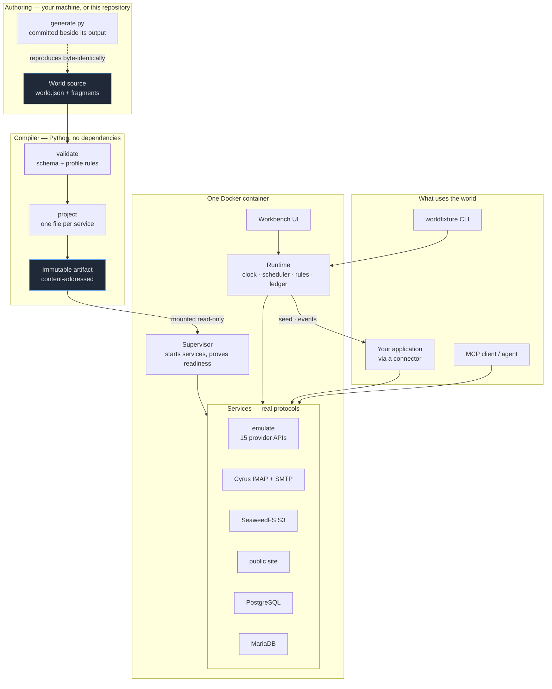
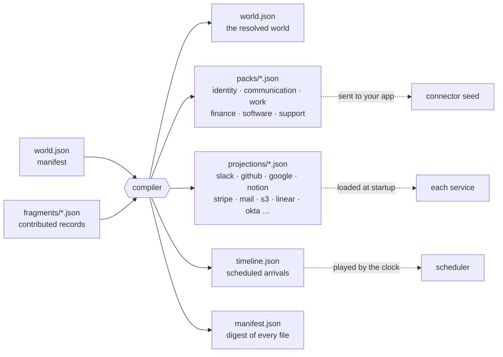
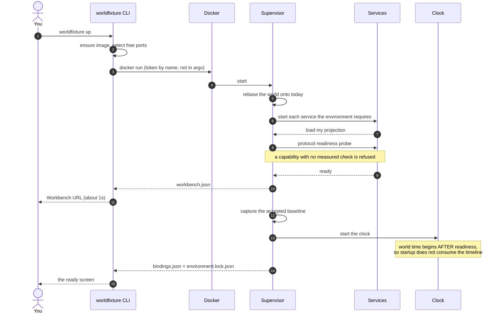
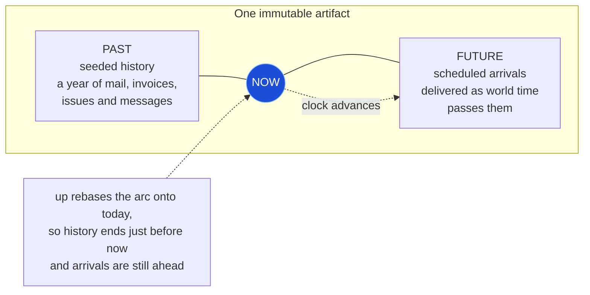
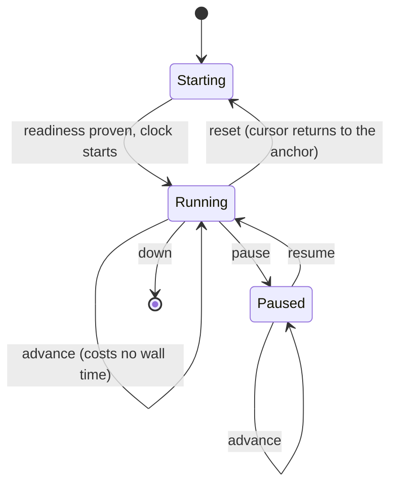
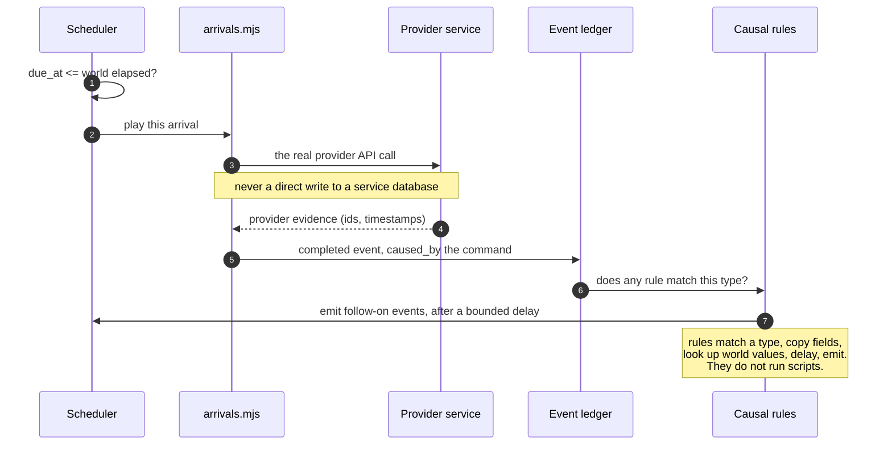
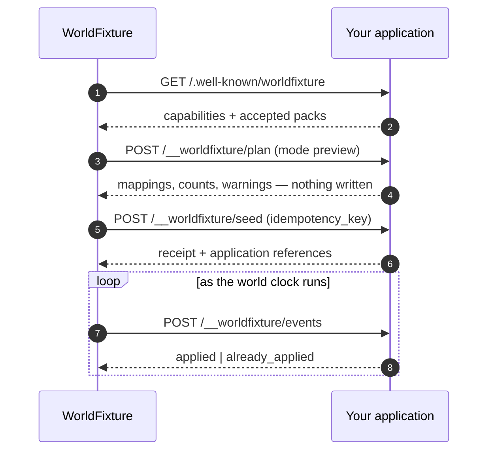
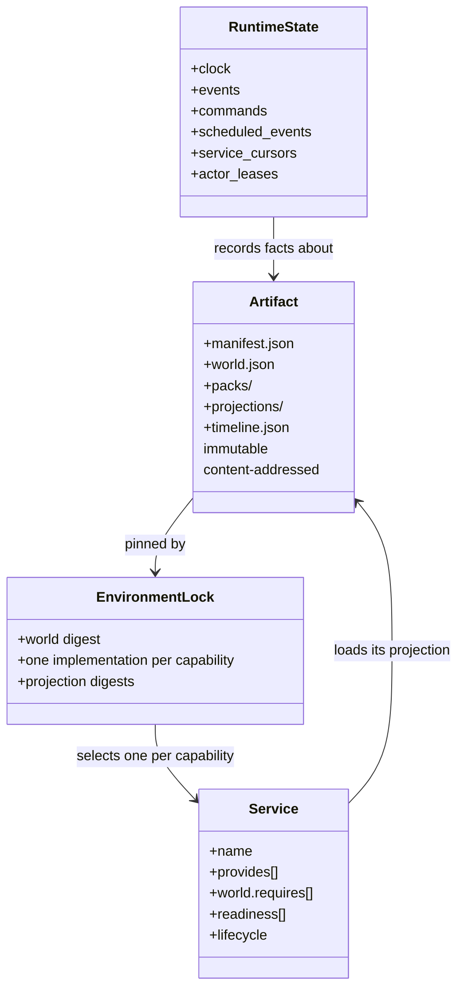

# WorldFixture architecture

How the system is built and how a world actually runs. This describes what is
implemented, not what is planned.

## What the pieces are

The runtime owns time, schedules, causal rules and the observation ledger. Each
service owns its own provider-specific state. The artifact owns the starting
facts. Nothing owns two of those.

## Compiling a world

Packs are the vendor-neutral view an application connector receives.
Projections are per-service views a service loads through its own seed
interface. Both come from the same records, which is what makes the surfaces
agree with each other.

The compiler is deterministic: the same source bytes always produce the same
artifact digest. No clock, no randomness, no filesystem order, no host values.

## Starting an instance

## The clock, and why the world is both immutable and live

The artifact holds the whole arc. `now` is a cursor inside it. Liveness is the
cursor moving, so nothing is generated at run time and the world stays
reproducible.

A pause costs no world time and an advance costs no wall time. That separation
is what lets you step a world for debugging, or jump a month forward in a demo,
without the artifact changing.

## How an event happens

Only a completed provider action creates an event. A proposal is not evidence.

An arrival kind the runtime cannot play is skipped **with its name in the
reason**. A world may declare a kind this runtime does not implement yet; it may
not have that pass unremarked.

## Connecting your own application

The connector runs inside your application, so it maps world records onto your
own domain model through your ORM or service layer. WorldFixture owns the
records, the clock and the delivery order; your application owns the mapping.

A slice may be sent instead of the whole world. A slice is always referentially
whole: it never contains a record that refers to a record it does not contain,
and it never empties a collection the world has records in.

## The artifact and the runtime state

`reset` restores provider, mail, storage, runtime, clock and timeline state to
the accepted baseline captured at startup. It preserves application database
data, because WorldFixture does not own your application's lifecycle.

## Rules that hold everywhere

1. A world is data. It is fully useful with no agents running.
2. Applications use real interfaces — Slack over the Slack Web API, mail over
   SMTP and IMAP, storage over S3, and so on. Nobody writes a service database.
3. The starting state is immutable. A run pins one artifact and one
   implementation per capability.
4. Each state has one authority.
5. Only a provider-shaped service can accept an action and change its state.
6. Cross-service behaviour is explicit world data, not code.
7. A capability with no measured readiness check is refused rather than claimed.
